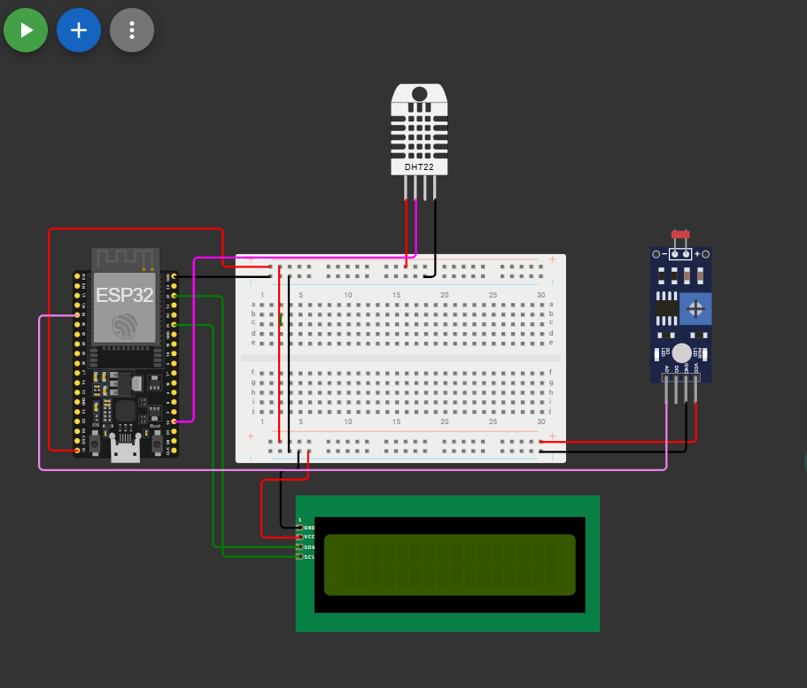
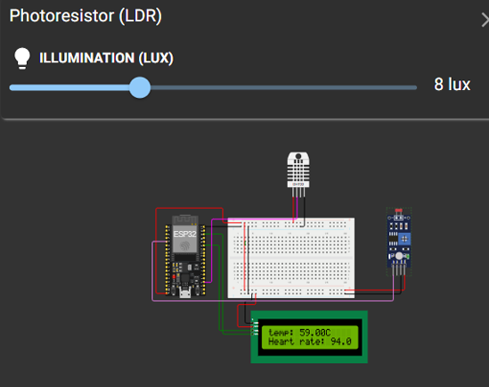
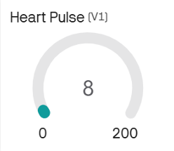
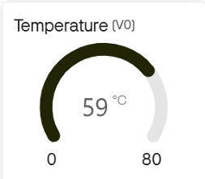

# IoT Based Health Monitoring System using ESP32

## Overview
In this project, I developed an IoT-based health monitoring system using the ESP32 microcontroller. The system measures body temperature using a DHT22 sensor and simulates heart pulse monitoring using an LDR sensor. The sensor data is processed by the ESP32 and sent to the Blynk IoT platform through Wi-Fi for real-time monitoring.

## Features
- Real-time health parameter monitoring
- Temperature measurement using DHT22
- Simulated heart pulse detection using LDR
- Wireless data transmission via Wi-Fi
- Cloud monitoring using Blynk IoT dashboard
- LCD display for local data visualization

## Components Used
- ESP32 Development Board
- DHT22 Temperature Sensor
- LDR Sensor Module
- 16x2 LCD Display (I2C)
- Breadboard
- Jumper Wires
- Wi-Fi Connectivity

## Working Principle
The ESP32 continuously reads temperature data from the DHT22 sensor and pulse values from the LDR module. The collected data is displayed on the LCD screen and simultaneously transmitted to the Blynk IoT platform via Wi-Fi. Users can monitor temperature and pulse readings remotely through the Blynk mobile dashboard.

## Circuit Diagram

## LCD Output

## Pulse Blynk Dashboard

## Temperature Blynk Dashboard

## Serial Monitor Output

## Software and Tools
- Arduino IDE
- Wokwi Simulator
- Blynk IoT Platform
- GitHub

## Applications
- Remote health monitoring
- IoT-based patient monitoring systems
- Smart healthcare devices

## Future Improvements
- Integration with real biomedical sensors
- Cloud data storage and analytics
- Mobile alert notifications
- Integration with wearable devices

## Conclusion
This project demonstrates a simple IoT health monitoring system capable of collecting sensor data and transmitting it to a cloud platform in real time. It shows how IoT technology can be applied to healthcare monitoring systems.
